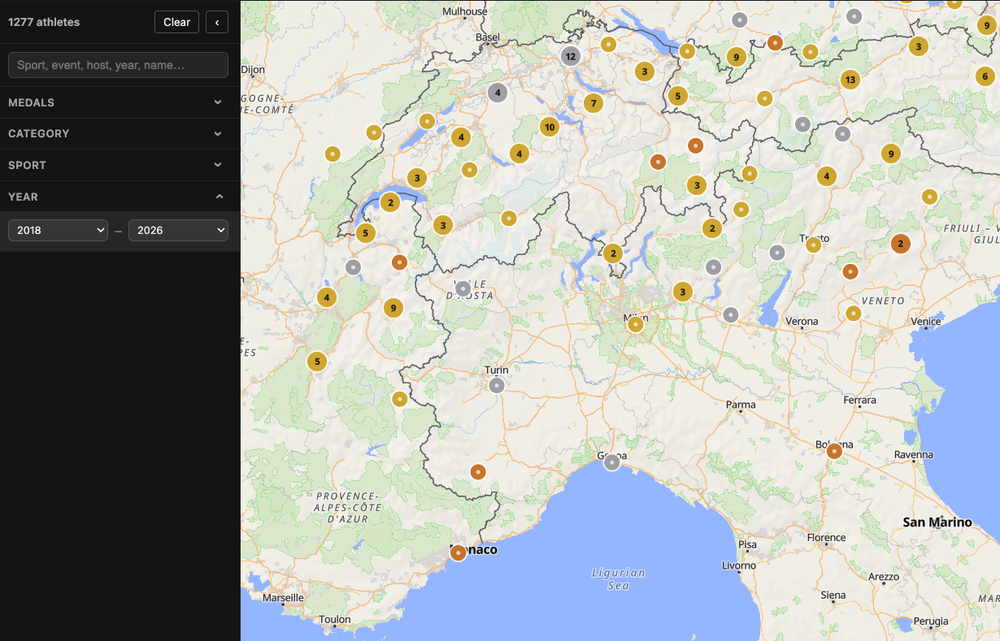

# Medal Map

[](https://github.com/vegardege/medalmap/actions/workflows/ci.yml)

Interactive map showing where Winter Olympic medalists were born.

**Live Demo**: https://medalmap.pebblepatch.dev/

## Screenshot



## Pipelines

The data pipeline scrapes Wikipedia and queries Wikidata to build a static `data/data.json` file that the web app reads at runtime.

Missing or incorrect data can be patched via `data/overrides.json` before merging, but contributing to Wikidata is strongly encouraged.

The project uses [MapLibre GL JS](https://maplibre.org/) for map rendering and [OpenFreeMap](https://openfreemap.org/) for map tiles.

## Setup

Clone the git repository and run:

```bash
npm install
```

## Data pipeline

The pipeline scripts are run manually to generate `data/data.json`.

All scripts accept an optional year argument. Omitting the year processes all known Winter Olympic games.

```bash
npm run pipeline:wikipedia            # scrape all editions
npm run pipeline:wikipedia -- 2026    # scrape one edition

npm run pipeline:wikidata                        # fetch Wikidata for all editions (incremental)
npm run pipeline:wikidata -- 2026                # fetch Wikidata for one edition (incremental)
npm run pipeline:wikidata -- --force             # force full re-fetch, ignoring cached results
npm run pipeline:wikidata -- --resolve-redirects # retry missing entries via Wikipedia redirect lookup

npm run pipeline:coverage             # report coordinate coverage per edition
npm run pipeline:coverage -- 2026     # per-sport coverage for one edition

npm run pipeline:merge                # merge all sources into data/data.json
```

Run wikipedia → wikidata → merge in order, then review `pipeline:coverage` and add any manual corrections to `data/overrides.json`.

Wikidata is fetched incrementally by default — athletes with complete data are skipped. Use `--force` to re-fetch everything. Some athletes return no Wikidata match because their Wikipedia page is a redirect; use `--resolve-redirects` to detect these and retry under the canonical title.

**Merge priority**: `overrides.json` > Wikidata > Wikipedia

## Development

```bash
npm run dev        # start dev server at http://localhost:5173
npm run build      # static build to `dist/`
npm run preview    # preview the built output locally
npm run check      # lint and format check (Biome)
npm run check:fix  # auto-fix lint and formatting
npm test           # run tests
```

## Deployment

The app is a static site. After `npm run build`, serve the `dist/` directory with any static file server.
